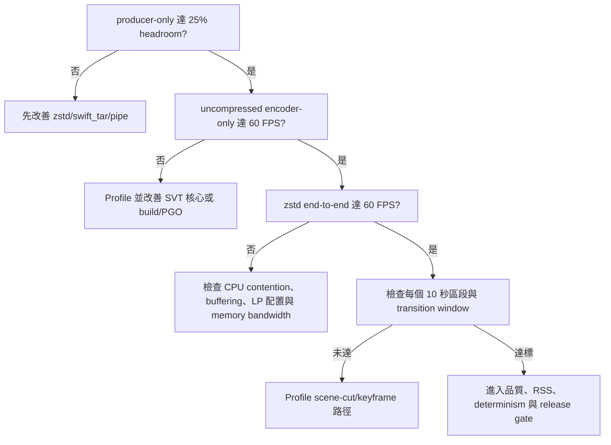

# swift_tar / bsdtar compatibility TODO

此文件列出目前已知、刻意接受，或尚未驗證到與標準 bsdtar 完全相容的項目。
`verifications/bsdtar_compat.sh` 會覆蓋常見 create/extract/list 互通性；本清單
保留尚未納入自動測試或目前設計上不追求完全一致的範圍。

## 測試錯誤碼

`verifications/bsdtar_compat.sh` 使用固定 exit code，方便 CI 或手動測試區分
問題類型：

- `0 OK`: 必要相容性檢查全數通過。
- `10 INCOMPATIBLE`: 工具成功執行，但解出內容、entry set 或 tar 語意與
  bsdtar 不一致。
- `20 ERROR`: 測試環境、工具啟動、參數或非 hang 類命令失敗。
- `30 HANG`: 子命令超過 `COMMAND_TIMEOUT_SECONDS`，預設 20 秒。

若同一次測試同時出現多類失敗，exit code 優先序為：
`HANG` > `ERROR` > `INCOMPATIBLE`。

## 已知不完全相容或刻意不支援

- **ZIP container**: `swift_tar --gzip -f something.zip` 仍輸出 gzip-compressed
  tar stream，不是 ZIP container。bsdtar 可處理 ZIP；swift_tar 目前不建立或解出
  ZIP。
- **LZFSE private formats**: `--other3-*` 與 `--bvx3-*` 是 swift_tar/lzfse2
  格式，標準 bsdtar 不支援。
- **Archive update modes**: bsdtar 支援 `-r`、`-u` 等更新既有 archive 的模式；
  swift_tar 目前只支援 create/extract/list/`--cat`。
- **Ownership / ACL / xattrs / file flags**: bsdtar/libarchive 可保存更多平台
  metadata。swift_tar 目前主要保存 tar entry name、type、mtime、regular file
  content、symlink target、hardlink relation；Windows 上不保存 ACL、owner、
  xattrs 或 file flags。
- **Windows permissions**: Windows 建立 archive 時使用慣例 mode（目錄
  `0755`、檔案 `0644`），解出時 chmod 為 no-op。這不等同 bsdtar 的完整
  permission/ACL 行為。
- **Special files**: device nodes、FIFOs、sockets 等特殊檔案目前會被略過或
  不完整支援。bsdtar 在 POSIX 平台可處理更多特殊 entry type。
- **Sparse files**: 尚未驗證或實作 GNU/libarchive sparse file 行為；目前應視
  為一般檔案資料處理，不保證保留 sparse layout。
- **Symlink extraction on Windows**: 需要 Developer Mode 或系統管理員權限。
  權限不足時 swift_tar 會警告並略過 symlink；bsdtar 行為可能依 Windows 設定
  與權限不同。
- **Hardlink extraction on Windows**: swift_tar 透過 `fsutil hardlink create`
  盡力建立 hardlink；若 filesystem 或權限不支援，會警告並略過。需持續測試
  是否與 bsdtar 在所有 Windows filesystem 上一致。
- **Codec coverage beyond common bsdtar flags**: 自動測試先覆蓋 plain、gzip、
  bzip2、xz，並選配測 zstd。lzip/lz4 是否能由 bsdtar create/extract 取決於
  該 bsdtar/libarchive build 的 codec 支援；目前不承諾每個平台一致。
- **Unicode path interoperability on Windows shell boundary**: 目前透過 Windows
  `cmd.exe` / System32 bsdtar 對照時，含中文路徑的 entry 會出現 codepage/UTF-8
  不一致：bsdtar list 會顯示 mojibake，且 bsdtar 解出 swift_tar 建立的 Unicode
  path archive 時可報 `Invalid empty pathname`。`verifications/bsdtar_compat.sh`
  先以 XFAIL 追蹤此缺口；後續需判斷是 archive PAX UTF-8 標記問題、cmd codepage
  問題，或 Windows bsdtar 行為差異。

## 應加入後續測試的項目

- Duplicate entries: 同一路徑在 archive 中出現多次時，確認後者覆蓋前者的
  extract 語意與 bsdtar 一致。
- PAX edge cases: 超長 linkname、非 UTF-8 path、large uid/gid、large mtime、
  超大檔案 size 欄位。
- Path safety: 絕對路徑、`..`、Windows drive-letter path、UNC path 在 extract
  時的處理要和安全策略明確對齊，不一定要模仿 bsdtar。
- Streaming stdin/stdout: `-f -` 與 pipe 組合的 create/extract/list/`--cat`
  互通性。
- Full list-output equivalence: 目前 `verifications/bsdtar_compat.sh` 只做
  list smoke（雙方都能列 archive，且看到必要 entry）。完整 entry-set diff
  應後續補回；前一版測試在本機 zsh/cmd/coreutils 邊界曾卡住，不適合作為
  當前穩定閘門。
- Append/update mode decision: 若未來要支援 `-r` 或 `-u`，需新增 bsdtar 對照
  測試；若決定永不支援，README 應明確列為非目標。
- Cross-platform metadata matrix: macOS、Linux、Windows 對 symlink、
  hardlink、mode、mtime、xattrs 的差異需分平台記錄。

---

# SVT-AV1-HDR 4K60 圖片序列 + swift_tar/zstd 改善計畫

## 目標、範圍與假設

審查基準:

- SVT-AV1-HDR: [juliobbv-p/svt-av1-hdr](https://github.com/juliobbv-p/svt-av1-hdr)，commit
  `8b4b9f5624cb70c2363a7cebb553110c1447dd4c` (2026-07-15)。
- 本機比較專案: `~/proj/lzfse2` 與 `~/proj/lzfse2/swift_tar`。
- 壓縮格式固定使用標準 zstd。LZFSE 不列入此輪輸入、封裝或效能矩陣。
- `swift_tar` 負責 zstd 解碼、資料集/結果封裝及後續可能的 tar member
  stdout 串流；SVT-AV1-HDR 仍是 AV1 影像編碼器。zstd 不能取代 AV1 編碼演算法。
- 4K 固定為 3840x2160，目標 frame rate 固定為 60/1。
- 每張圖片顯示 10 秒，即每張 600 frames。每個 SDR/HDR 完整 corpus 預設
  6 張圖片、60 秒、3600 frames。
- 將「diff stepping files」同時落成兩件事:
  1. 多個可追蹤的設定階梯檔(setting-step files)。
  2. 可選的畫面差異步進素材(diff-step corpus)，避免完全靜止畫面高估效能。
- 60 FPS 是離線編碼吞吐量，不代表即時播放，也不代表編碼器會丟棄 frame。

## 審查結論與優先級

### P0: 現有 benchmark 計時不能判定 60 FPS

`test/benchmarking/utils.py:96-160` 回傳 user+system CPU time，而不是 wall-clock
time。多執行緒編碼時 CPU time 會隨核心數累加，不能用來計算即時 FPS。
同一函式以 `/bin/sh` 執行 `for i in {1..N}`；POSIX `sh` 不保證支援 brace
expansion，卻仍以 N 當分母，短測試可能被低估。第一步必須改成
`time.perf_counter_ns()`、明確 argv、逐次執行及 `check=True`。

### P0: 現有結果只有累積平均，無法驗證每 10 秒切圖

`Source/App/app_process_cmd.c:1092-1204` 的 detailed progress 及
`Source/App/app_main.c:304-320` 的 summary 都是累積值。即使整體平均超過
60 FPS，也可能在 600、1200、1800 frame 的切圖點大幅掉速。需要輸出可解析的
frame/time JSONL，至少每 60 frames 一筆，並在每個 600-frame 區段及切圖前後
各自計算 FPS。

### P0: 目前 video config 不是 4K60 多核心測試

`test/benchmarking/configs/test_video_config.yaml:145-152` 對 SVT 使用
`--lp 1`，而 `encode.py:253-270` 又可能同時啟動多個 encode job。這量到的是
多工作吞吐，不是單一 4K60 encoder。該 YAML 將值命名為 `nthreads`，但 SVT
4.x 的 `--lp` 實際是 0 到 6 的 LevelOfParallelism，不是 thread/core 數。
絕對 60 FPS gate 必須使用 `max_processes: 1`，再獨立掃合法的 `--lp` level。

### P1: benchmark runner 尚未支援原生 Windows

`config_manager.py:100-104` 只區分 Darwin 與 Linux；`encode.py:254` 和
`decode_and_qm.py:467` 無條件呼叫 `os.nice(10)`；計時又依賴
`/usr/bin/time`。本機是 Windows，因此要加入 `windows_x86_64` binary map、
Windows 可用的 wall/RSS collector，並讓 `os.nice` 只在支援的平台執行。

### P1: swift_tar 尚不能把 tar.zst 中的指定 Y4M member 直接餵給 encoder

`swift_tar --cat` 只移除 compression filter；對 `.tar.zst` 輸出仍是 tar
stream。CLI 雖解析 positional files (`swift_tar.swift:2807-2815`)，read path
卻未把它傳給 `runRead` (`:2821-2826`)。立即可用路徑是把原始 Y4M 壓成
`.y4m.zst`，再用 `swift_tar --cat` 解碼。後續才新增「指定 regular member
輸出至 stdout」，且不得改變既有 `--cat` 語意。

### P1: PGO 與 release gate 不代表此工作負載

`.github/workflows/pgo-build.yml:71-75` 等平台只用單一 `FoodMarket2`
素材及一組參數訓練 PGO；workflow 在 main push 後直接建立 release，沒有先依賴
unit/e2e 或 4K smoke gate。PGO 應加入 4K SDR、4K HDR PQ、grain、screen
content 與切圖 workload；release 前至少要有正確性 smoke test。GitHub runner
不可用絕對 60 FPS 當 gate，只能用相對 baseline regression。

### P2: 完全重複的靜止 frame 會高估一般 4K60 能力

每張圖重複 600 次仍是使用者指定的正式 workload，但結果只能聲稱適用於
「10 秒靜止圖輪播」。另建 deterministic diff-step corpus，用微小平移、亮度
step 及固定種子 grain 產生 frame-to-frame 差異，作為較嚴格的第二條曲線。

## 4K60 原始資料頻寬預算

| 格式 | 每 frame | 60 FPS 原始流量 | 10 秒/張 | 60 秒 corpus |
|---|---:|---:|---:|---:|
| YUV420p 8-bit | 12,441,600 B (11.87 MiB) | 711.9 MiB/s | 6.95 GiB | 41.71 GiB |
| YUV420p10le | 24,883,200 B (23.73 MiB) | 1,423.8 MiB/s | 13.90 GiB | 83.43 GiB |

因此 zstd producer-only gate 應保留至少 25% headroom:

- 8-bit: 解壓並寫入 stdout 至少 890 MiB/s。
- 10-bit: 解壓並寫入 stdout 至少 1,780 MiB/s。

若 file input 已達 60 FPS、zstd pipe 未達 60 FPS，問題屬於 producer、pipe、
memory bandwidth 或 CPU contention，不應先改 AV1 核心。

## 圖片清單與 corpus

所有來源都要有可重散布授權或內部使用許可，並記錄 SHA-256。不得把 SDR
圖片直接標成 HDR；SDR 與 HDR PQ 必須生成兩條獨立 Y4M sequence，因為同一條
AV1 sequence 的色彩 metadata 不能每 10 秒任意切換。

| ID | Corpus | 內容類型 | 主要壓力 |
|---|---|---|---|
| sdr-01 | SDR | 日光照片、細節豐富 | texture、foliage |
| sdr-02 | SDR | 夜景與暗部 | shadow、banding |
| sdr-03 | SDR | 動畫、大片平色 | edge、blocking |
| sdr-04 | SDR | 桌面/UI/小字 | screen content、sharpness |
| sdr-05 | SDR | 細緻漸層/天空 | gradient、banding |
| sdr-06 | SDR | 高 ISO/膠片顆粒 | grain、noise |
| hdr-01 | HDR PQ | 高亮日景 | highlight retention |
| hdr-02 | HDR PQ | 暗景與局部高亮 | PQ shadow/highlight |
| hdr-03 | HDR PQ | 霓虹與高飽和色 | chroma、gamut |
| hdr-04 | HDR PQ | 金屬/鏡面反射 | specular highlight |
| hdr-05 | HDR PQ | 動畫/CG 漸層 | HDR banding |
| hdr-06 | HDR PQ | 原生顆粒/低照度 | HDR grain |

`manifest/images.csv` 最少欄位:

```text
id,corpus,path,source_url,license,sha256,width,height,bit_depth,primaries,transfer,matrix,range,duration_s
```

固定規則:

- 所有圖片先以 color-managed 路徑正規化到 3840x2160，不可無記錄地拉伸。
- 不足比例時使用固定黑邊或 center crop，選擇寫入 manifest。
- SDR control: yuv420p、BT.709。
- HDR corpus: yuv420p10le、BT.2020 primaries、SMPTE ST 2084/PQ、
  BT.2020 non-constant matrix。
- 每個 sequence 的 frame 數須由 `ffprobe` 與 runner 同時驗證為 3600。
- 每 600 frames 必須對應下一個 manifest ID。

## diff-step 素材階梯

每個 corpus 產生以下獨立 sequence；不可混在同一測試中後只報一個平均值:

1. `static`: 每張圖完全相同地重複 600 frames，正式使用者 workload。
2. `luma-step`: 每 60 frames 以合法 code value 做極小亮度 step。
3. `pan-step`: 每 60 frames 做 deterministic 1-pixel 平移後回到原位。
4. `grain-step`: 每 frame 套固定規則與固定 seed sequence 的微量 grain。
5. `hard-cut`: static 內容不變，但特別量測 599/600/601 frame 的切圖成本。

所有產生器版本、filter graph、seed 與輸出 SHA-256 都寫入
`manifest/generated.json`。同一 A/B 比較必須使用完全相同的 Y4M bytes。

## zstd 與 swift_tar 資料路徑

### 立即可執行的格式

- 原始編碼輸入: `sequence.y4m`。
- 壓縮編碼輸入: raw `sequence.y4m.zst`，不是 tar container。
- 圖片、manifest、settings 與結果封裝: `dataset.tar.zst` /
  `results.tar.zst`。
- raw Y4M 固定用 stock `zstd -T0 -9 --long=27 --check` 建立；編碼時用
  `swift_tar --cat` 的 in-process libzstd decoder 解開。
- `swift_tar -c --zstd` 預設 level 9 且每 4 MiB chunk 一個 zstd frame。
  此輪 raw Y4M 與 tar 封裝一律明確指定 `-9`，並分開記錄 producer 與
  encoder throughput。

範例(由 zsh 執行):

```zsh
zstd -T0 -9 --long=27 --check -f sequence.y4m -o sequence.y4m.zst

/c/Users/lowei/proj/lzfse2/swift_tar/release/swift_tar.exe \
  --cat -f sequence.y4m.zst > /dev/null

/c/Users/lowei/proj/lzfse2/swift_tar/release/swift_tar.exe \
  --cat -f sequence.y4m.zst |
  SvtAv1EncApp.exe -i stdin -b output.ivf --preset 13 --crf 35 \
    --fps-num 60 --fps-denom 1 --progress 0
```

HDR command 必須另外帶入正確 bit depth 與 CICP metadata，不可沿用 SDR command。

### swift_tar 後續改善(非第一階段 blocker)

新增 bsdtar-compatible「選取單一 regular member 並輸出 stdout」能力，名稱與
bsdtar 對齊後再定案；不改變 `--cat`。驗收項目:

- `dataset.tar.zst` 中指定 `sequence.y4m` 可直接 pipe 給 encoder。
- 未找到 member、找到 directory、重複同名 member、截斷 zstd/tar 都要非 0
  exit。
- stdout 只能有 payload；進度與錯誤只能寫 stderr。
- 驗證輸出 SHA-256 與直接解出檔案完全一致。
- pipe consumer 提前退出時，不得 hang；producer 應正確處理 broken pipe。
- plain tar、zstd tar、stdin `-f -` 及 Windows binary mode 都要覆蓋。

## 設定階梯檔

不要手寫完整 Cartesian product。以 `settings/matrix.yaml` 產生具固定 ID 的
`.cfg` 或 `.args` 檔，並輸出 `settings/manifest.csv`。每次 run 都保存展開後
的完整 argv。

### A. 速度粗掃

- Preset: 13、12、11、10、9、8。
- 固定: CRF 35、tune 0、單一 encoder process、`--lp 0`(auto)。
- 目的: 找出達 60 FPS 的最低 preset，也就是品質較佳但仍達標者。

### B. LevelOfParallelism 掃描

- 只對 A 階段前兩名執行。
- `--lp` 是 level，不是 thread/core 數；合法範圍為 0 到 6。
- 掃 `--lp`: 0(auto)、1、2、3、4、5、6。本機目前可見的 12 logical
  processors 只記入 machine provenance，不直接當 `--lp` 值。
- 同時記錄 CPU utilization、peak RSS、溫度起訖及 wall time。

### C. 品質/內容設定

- CRF: 24、30、35、40。
- tune 0: 一般 VQ/細節保留。
- tune 5: grain corpus；不得把結果外推到所有內容。
- HDR: `--transfer-characteristics 16` 自動 PQ variance curve，另做一個
  explicit curve 3 control，確認兩者行為一致後才刪除重複組。
- CDEF/noise-adaptive/film-grain 相關參數採 one-factor-at-a-time；只有通過
  60 FPS 的候選才進完整 CRF sweep。
- tune 3 是 all-intra/AVIF 導向，不納入此 inter-frame 4K60 主矩陣。

### D. Build 與 input A/B

- Build: Release、LTO、LTO+現有 PGO、LTO+4K60 corpus PGO。
- Input: uncompressed Y4M file、raw Y4M.zst -> `swift_tar --cat` pipe。
- Corpus: SDR/HDR x static/diff-step。
- 不做完整相乘。先以 SDR static 篩選，再以 shortlist 跑其餘 corpus。

建議 config ID:

```text
p13-lpauto-crf35-t0-sdr-static
p12-lp6-crf35-t0-sdr-static
p12-lp6-crf30-t0-hdr-pq
p12-lp6-crf30-t5-sdr-grain
```

## Benchmark runner 必修項

優先延伸既有 `test/benchmarking`，不要另做互不相容的 framework:

1. `utils.py`: 使用 `perf_counter_ns` 計 wall time；child user/system time
   只作診斷欄位，不再叫做 encode time。
2. 命令改為 argv list；需要 pipe 時以兩個 `Popen` 明確連接，不使用
   `shell=True` 字串。
3. 所有 process 使用 `check` 語意，保存 producer/encoder 各自 exit code
   與 stderr。
4. 新增 `windows_x86_64` binary section；`os.nice` 做 capability check。
5. 絕對 FPS 測試固定 `max_processes: 1`。多 job throughput 另列，不混用。
6. 每組 1 次 warm-up + 3 次 measured run，報 median、min、max；config 執行
   順序 randomized，但 seed 固定並記錄。
7. 每輪使用新的 run directory，不呼叫 `clean_directory` 刪除舊結果。
8. 記錄 machine/build provenance: OS、CPU、logical/physical cores、RAM、
   power plan、compiler、flags、SVT commit、swift_tar commit、zstd commit、
   ffmpeg version。
9. 每輪前後記錄 CPU temperature；以回到固定溫度區間取代無條件長時間 sleep。
10. 加 producer-only、encoder-only、end-to-end 三種 mode，CSV 不得只留一個
    `encode_time`。

## 建議的 SVT machine-readable progress

第一輪可先用 final summary 判定整體 FPS；要驗證 10 秒區段，建議在
`Source/App` 新增 opt-in JSONL progress，不改預設 CLI 輸出:

```json
{"frame":600,"encode_elapsed_s":8.91,"wall_elapsed_s":9.42,"bytes":1234567,"latency_ms":16.1}
```

要求:

- 預設關閉；開啟後每 60 frames 或使用者指定 interval 寫一筆。
- 使用 monotonic clock。
- JSONL 寫指定檔案或 stderr，永不混入 bitstream stdout。
- progress I/O 自身的 overhead 要以 on/off A/B 驗證低於 1%。
- 區段 FPS = 600 / 相鄰切點 elapsed 差。
- transition FPS 另外量 frame 570-630 與 1170-1230 等跨切圖窗口。

## CSV schema 與結果封裝

`runs.csv` 至少包含:

```text
run_id,timestamp,svt_commit,swift_tar_commit,zstd_version,build_id,
corpus,variant,config_id,preset,lp,crf,tune,bit_depth,transfer,input_mode,
frames,wall_s,svt_encode_s,encoder_fps,pipeline_fps,segment_min_fps,
transition_min_fps,peak_rss_mib,producer_mib_s,bitrate_kbps,output_bytes,
producer_exit,encoder_exit,output_sha256,temp_start_c,temp_end_c
```

每輪另保存:

- `segments.csv`: 每 600-frame 區段與 transition window。
- `command.json`: 完整 argv、環境白名單與 cwd。
- `stderr/producer.log`、`stderr/encoder.log`。
- `manifest.json`: 所有 input/config/binary hash。
- decoded sample metrics 與 ffprobe metadata。

完成後以:

```zsh
/c/Users/lowei/proj/lzfse2/swift_tar/release/swift_tar.exe \
  -c --zstd -9 -f results.tar.zst -C /path/to/bench results manifest settings
```

封裝。封裝後立刻 `-t`、解到新目錄、比對 manifest hash，才可刪除未壓縮的
大型中間檔。

## 驗收標準

### 正確性 gate

- 每條 sequence 恰好 3600 frames、3840x2160、60/1。
- SDR/HDR bit depth 與 CICP metadata 符合 manifest。
- raw Y4M、zstd 解壓 stdout 與 benchmark 實際 stdin 的 SHA-256 一致。
- producer 與 encoder exit code 都是 0，bitstream 可由 dav1d 解碼。
- 每張圖抽查 frame 300；每個切點抽查 599/600/601。
- 只做效能最佳化時，優先要求 bitstream hash 不變；若演算法改動使 bitstream
  合理改變，則必須通過 decoder、品質及 bitrate gate。

### 60 FPS gate

- Encoder-only: 3 次 measured median `encoder_fps >= 60.0`。
- 每個 600-frame 區段 `segment_fps >= 60.0`，不能只靠其他區段補平均。
- 每個 transition window `transition_fps >= 60.0`。
- End-to-end zstd mode: producer 與 encoder 均成功，median
  `pipeline_fps >= 60.0`。
- producer-only 必須先達前述 25% headroom；否則 end-to-end 結果標為
  `PRODUCER_LIMITED`，不可歸咎 SVT。

### 品質與資源 gate

- 同一 bitrate 區間比較 VMAF/SSIM/PSNR/SSIMULACRA2；HDR 不可只用 SDR
  metric 宣稱無退化。
- 效能 patch 的 bitrate 與品質不得超出事先設定的 tolerance。
- Peak RSS 不得無解釋增加超過 10%。
- 不得出現 nondeterminism、hang、截斷 bitstream 或 producer broken-pipe
  死鎖。

## 實作階段

### Phase 0: 固定 baseline

- [ ] 記錄上述 SVT commit、本機 swift_tar commit、zstd/ffmpeg/compiler 版本。
- [ ] 建立唯一 run root，不覆寫既有 benchmark。
- [ ] 先跑 unit/e2e smoke，確認 baseline 本身可用。

### Phase 1: 修正 benchmark 基礎

- [ ] 修正 wall-clock、brace-loop、exit status 與 argv 問題。
- [ ] 加 Windows binary/config/RSS 支援。
- [ ] 加 producer-only、encoder-only、pipeline modes。
- [ ] 以可預期 sleep command 與小型 encode 寫 timing regression tests。

### Phase 2: 建立 4K 圖片 corpus

- [x] 建立 `images/` 本機來源與 6 張原創 4K SDR 分鏡（每張 10 秒，共 60 秒）。
- [x] 產生 60 秒、3600-frame 的 4K60 SDR 預覽與 `Y4M + Zstd -9` 測試檔。
- [ ] 建 images.csv、授權與 hash。
- [ ] 生成 SDR/HDR static sequence。
- [ ] 生成 luma/pan/grain diff-step sequence。
- [ ] ffprobe 驗證 4K、60/1、3600 frames 與 metadata。

### Phase 3: 接上 zstd/swift_tar

- [ ] zstd levels 1、3、6、9 各量 ratio 與 producer MiB/s。
- [ ] 主 benchmark 固定使用 level 9；其他 level 僅作 throughput/ratio 對照。
- [ ] stock `zstd -dc` 與 `swift_tar --cat` 做 A/B，分辨 libzstd 與 wrapper
  overhead。
- [ ] 若 raw .y4m.zst 已足夠，先不改 swift_tar CLI。

### Phase 4: 設定階梯與 per-segment metrics

- [ ] matrix.yaml 產生所有 settings files 與 manifest。
- [ ] 跑 preset 粗掃，再跑 LP，再跑品質/HDR shortlist。
- [ ] 加 JSONL progress 或等價的精確區段 timestamp。
- [ ] 對每個切圖點輸出 segments.csv。

### Phase 5: Profile 後再改 SVT 核心

- [ ] 先判定瓶頸屬 producer、input copy/memory bandwidth、thread scheduling、
  scene cut、high-bit-depth mode decision、transform、CDEF/restoration 或 entropy。
- [ ] 只優化 profiler 顯示的 top hot paths，不先猜測重寫 codec。
- [ ] 每個 patch 都以同一 corpus/config 做前後 A/B。
- [ ] 先嘗試低風險 build/PGO 改善，再考慮 SIMD、copy reduction 或排程改動。

### Phase 6: CI 與 release

- [ ] PR: 小型 correctness smoke + timing unit tests。
- [ ] Nightly: 完整 4K60 相對效能矩陣。
- [ ] Local reference machine: 絕對 60 FPS gate。
- [ ] Release job 依賴 unit/e2e/smoke 成功。
- [ ] PGO corpus 加入 4K SDR/HDR/diff-step，不再只依賴 FoodMarket2。

### Phase 7: 選配 swift_tar member-to-stdout

- [ ] 先寫 bsdtar 相容語意與 CLI 決策。
- [ ] 實作 selected regular member stdout，不改 `--cat`。
- [ ] 加 zstd/stdin/Windows/broken-pipe/duplicate-member tests。
- [ ] 用同一 4K60 pipeline 證明新路徑沒有 throughput 或 RSS 回歸。

## 瓶頸決策



## 第一個可交付 PR

第一個 PR 不碰 AV1 演算法，範圍限制為:

1. 修正 benchmark wall-clock 與多 pass。
2. 加原生 Windows 設定。
3. 加單一 4K60 SDR static corpus config。
4. 加 `file` 與 `raw-y4m-zstd-pipe` 兩種 input mode。
5. 輸出 runs.csv、segments.csv、完整 provenance。

這個 PR 完成後才能可信地回答「目前哪個 preset/build 達 4K60」；下一個 PR
才依 profile 結果選擇 SVT 核心、PGO corpus 或 swift_tar pipeline 的改善方向。
